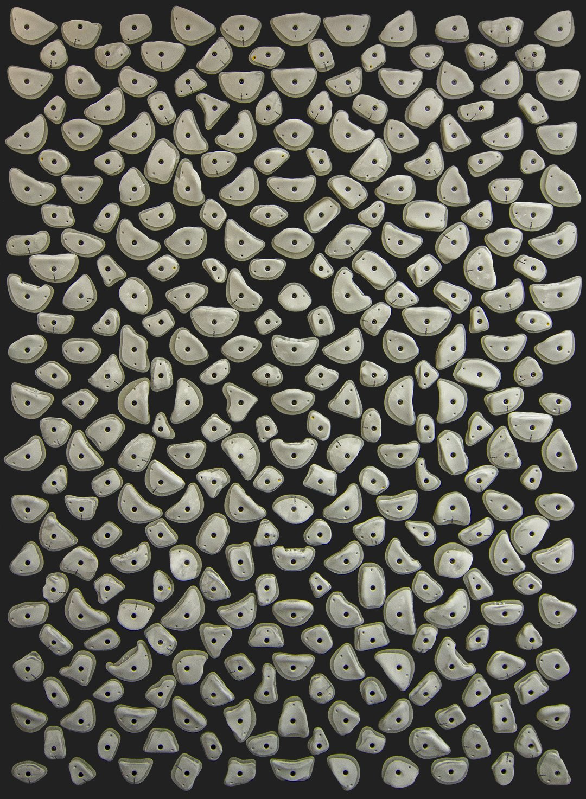
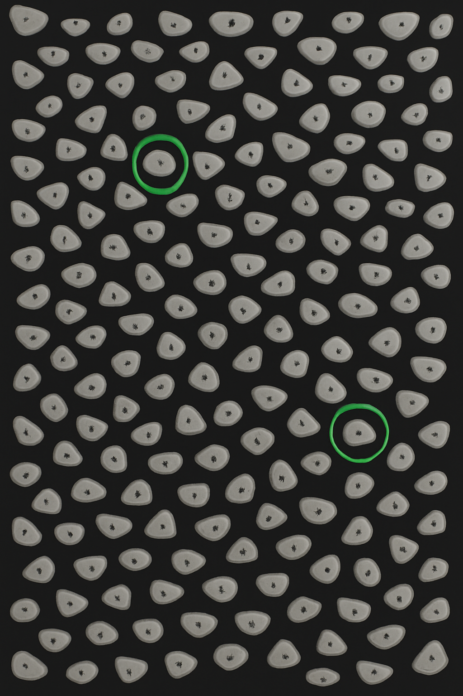

# Doku

##  Technische Möglichkeiten von GPT Assistenten
https://chatgpt.com/share/68f8c433-f834-800c-bc17-439c498e033b
### System Instructions
Die System Instructions können genutzt werden um dem Assistant einen groben Rahmen zu geben wie er sich verhalten soll, wie Tief ins Detail er mit seinen Antworten gehen soll und für welches Themenfeld er geschaffen ist.
### Files / File Search
Man kann dem Assistenten Textdateien hochladen damit er damit arbeiten kann. Der Assistant kann die Dateien als Wissensquelle nutzen um Themen über die er nicht viele informational hätte besser zu verstehen und spezifische Antworten zu geben.
### Code Interpreter
Der Code Interpreter wird dafür genutzt Python Code auszuführen um Daten zu analysieren, Diagramme zu erstellen oder Berechnungen durch zu führen. Der Assistenten schreibt dann Python Code um das resultat des Ausgeführten codes dem Nutzer auszugeben.
### Functions
Über Functions kann ein Assistenten mit externene Systemen kommunizieren, oder man kann sich zurückgegebenen Daten strukturieren lassen. Das heisst der Assistant kann selbst API-Abfragen machen und die rückgabe verarbeiten.

## Ideen
### Kilter Assistant
Das Kilter Board ist ein standardisiertes Trainingsboard zum Boulder.
Ein Assistant, der Boulder-Probleme auf dem standardisierten Kilter Board erstellt.
Der User soll einen Schwierigkeitsgrad von V0-V16 wählen. Daraufhin generiert der Assistant eine Kletterroute, indem er bestimmte Griffe auf dem Board auswählt.
Damit der Assistant nicht irgend ein Bild generiert wird ein Bild von einem Kilter Board hinterlegt. 
Das Ergebnis wäre dann das mitgegebene Bild mit den ausgewählten Griffen umkreist.

| Original                                 | Generated                                         |
|------------------------------------------|---------------------------------------------------|
|  |  |


#### Auswertung
Das Kilter Board wird weltweit genutzt und ist wie schon erwähnt standardisiert. Deshalb könnte der Assistant wirklich benutzt werden.
Allerdings hat sich beim Testen, im OpenAI Playground, herausgestellt, dass das Bearbeiten von Bilder nicht gut funktioniert.
Auch die einschätzung des Schwierigkeitsgrades ist schwer da man auf Bildern nicht gut erkennt wie gut ein Griff ist.
Daher haben wir uns schlussendlich gegen die Idee entschieden.

### Dichter
Die Idee hierbei ist, dass der Assistant ein Gedicht auf basis eines Dichters, eines Gedichttyps und eines Themas oder Bildes schreibt.
Zum Beispiel kann der Nutzer "Goethe", "Sonett" und "Wolf" angeben, daraufhin generiert der Assistant ein neues Sonett über einen Wolf im Stil von Goethe.
Wenn man alternativ ein Bild anstelle von einem Thema mitgibt wird das Thema aus dem Bild heraus analysiert.

#### Auswertung
Diese Idee fanden wir besonders Geeignet für das Project da sowohl Text als auch Bild verwendet werden. Auch der Umsetzung stand Technisch nichts im Weg.
Bilder können gut analysiert werden und es gibt viele Gedichte von unterschiedlichen Dichtern. 
Schwierigkeiten könnten allerdings auftreten, wenn der gewählte Dichter nie in der angegebenen Gedichtform geschrieben hat, da der Stiel dann stark abweichen könnt.

### Yoda
Der Assistant der beliebige Texte und Files so umschreibt, als ob Yoda (aus Star Wars) sie geschrieben hätte.
Man gibt der KI einfach eine Text-Datei oder ein Text und Bekommt einen Text raus der von Yoda geschrieben wurde.

#### Auswertung
Die Idee fanden wir lustig. Die technische Umsetzung währe gut möglich gewesen und hätte interessante Aspect wie das Auslesen und Schreibe von Dateien beinhaltet.
Wir haben uns dagegen entschieden da wir einen sehr geringen Nutzen sahen.

## Umsetzen

### Backend
Als erstes wurde ein einfacher request an die OpenAI client.responses.create endpoint gemacht was sich als unkompliziert erwies. 
Dieser Endpoint wird in vielen beispielen in der OpenAI Dokumentation für Text generation und Bild analyse verwendet.
Nach dem es möglich war, erfolgreich eine Antwort vom Endpoint zu erhalten, haben wir überlegt wie wir den API-Key einbauen.
Schlussendlich wurde entschieden, dass der User den API-Key selbst mitgeben muss. Das hat den Vorteil, dass der API-Key auf Seiten der Applikation nicht hinterlegt wird.
Durch diese Entscheidung haben wir uns bewusst auch dagegen entschieden einen Assistent, aus dem Playground, zu nutzen. 
Ein weiterer grund keinen Assistent zu nutzen war, dass Assistents nur mit dem API-Key des eigenen Accounts angesprochen werden können.
Stattdessen wird ein normales Modell (GPT 4o) angesprochen. Das Model 4o eignet sich besonders für kreative Aufgaben und kann auch Bilder analysieren.

#### Prompt
Die meiste arbeit wurde in das erstellen von den Systemprompts/Instructions gesteckt. 
Es gibt zwei unterschiedliche Prompts einen für den fall, dass ein Thema mitgegeben wird, und der Andere für den fall, dass der User ein Bild anstelle des Themas mit gibt.

Zunächst wird die Rolle der KI definiert, in der festgelegt ist wie sich die KI zu verhalten hat und was sie verarbeiten soll.
Danach wird der KI erklärt was sie mit den Inputs des Users machen soll.
Als letztes wird noch festgelegt wie der Output strukturiert sein soll und es wird ein Beispiel gegeben.
Der ganze prompt ist als Anleitung aufgebaut, die befolgt werden soll. Damit sollen konsistente Ergebnisse erzielt werden.
```python
system_prompt_theme = """
Your role:
You are a poetic writing assistant who creates original poetry inspired by great poets and visual or conceptual themes.

- Accept three main inputs from the user:
1. The <name of a poet> whose style and voice you should emulate.
2. The <type of poem> to write (e.g., haiku, sonnet, free verse, limerick, ode, etc.).
3. The <topic or theme> of the poem.

Your task:
- If a topic is given, write a poem about that topic in the requested style and form.
- Always stay true to the poetic tone, rhythm of the chosen poet.
- The result should feel like an original work written by that poet.
- Do not copy any existing work.

Formatting:
- Start with the title of the poem (invented by you).
- Then present the poem itself, properly formatted.

Example Behavior:
If the user says:
    > Poet: Emily Dickinson
    > Poem Type: Haiku
    > Topic: A withered rose
    
→ You respond with a haiku in Dickinson’s introspective style about a fading rose.
"""
```
#### Anfrage
Wir sprechen den Endpoint OpenAI.responses.create an. Wir haben uns für das Model gpt-4o entschieden es soll gut für kreative Aufgaben sein und kann auch Bilder verarbeiten.
In dem feld "instructions" geben wir Anweisungen mit was das Model mit den vom User mitgegebenen Werten anstellen soll und wie der Output aussehen soll. 
Wir belassen die Temperature (determinismus Wert) hierbei auf dem standard Wert (0.7), was nach unseren Tests, eine gute Balance zu sein scheint.
```python
client = OpenAI(api_key=api_key)
        
response = client.responses.create(
            model="gpt-4o",
            instructions=system_prompt_theme,
            input=user_prompt_theme(poet, type, topic)
        )
```
#### Input Validierung
Das Model zeigt Schwierigkeiten mit frei erfundenen Inputs oder wenn nicht existierende Gedichttypen angegeben werden.
Die Problemen zeigen sich im Output format das nicht eingehalten wird.
Um dem entgegen zu wirken wurde eine Input Validierung eingebaut. Die Inputs werden auch von der KI geprüft. Wenn die Inputs nicht verstanden werden wird schlicht "false" zurückgegeben (ansonsten "true").
Um der KI so wenig spielraum wie möglich zu geben reduzieren wir die Temperature auf 0.0 (deterministische Antworten) und
die maximale Anzahl an Output Tokens auf das zugelassene minimum von 16 (wünschenswert wären 1 oder 2 Tokens). Die Tokenlimitierung bewirkt, dass nur so wenig Text wie möglich zurückgegeben werden kann. 
Da wir für die Validierung keine komplexen anforderungen haben reicht es, wenn wir ein kleineres, günstigeres und schnelleres Model ansprechen. Wir nutzen hier das gpt-4o-mini.

Die Validierung mittels KI bring die Vorteile mit sich, dass so auch Rechtschreibfehler kein problem darstellen.
Auch hat der Nutzer dadurch mehr Möglichkeiten verschiedene Dichter anzugeben da es keine fixe Liste geben muss.
```python
def is_valid_input(poet, type, api_key):
    try:
        client = OpenAI(api_key=api_key)

        response = client.responses.create(
            model="gpt-4o-mini",
            instructions=validate_input,
            input=f"> Poet: {poet}\n> Poem Type: {type}",
            temperature=0.0,
            max_output_tokens=16
        )

        assistant_message = response.output_text.strip().lower()

        if assistant_message == "false":
            return False
        else:
            return True

    except Exception as e:
        raise HTTPException(status_code=500, detail=str(e))
```

#### Text to Speech
Als zusätzliches Feature haben wir eine Text-to-Speech Funktion integriert, damit man sich das generierte Gedicht vorlesen lasse kann. Dazu nutzen wir die Google Text-to-Speech library (gTTS).
```python
def tts(assistant_message):
    audio_bytes = BytesIO()
    gTTS(assistant_message).write_to_fp(audio_bytes)
    audio_bytes.seek(0)
    audio_data = audio_bytes.read()
    audio_base64 = base64.b64encode(audio_data).decode('utf-8')
    return audio_base64
```

### Frontend
Das Frontend wurde mit Typescript und dem Framework React umgesetzt.
Da man mit React nur schlecht ein Modernes design umsetzen kann, wurde [Material UI (MUI)](https://mui.com/material-ui/) verwendet.

#### Design
MUI verwendet das Material Design von Google, welches ein recht modernes und einfach verständliches design bietet.
Das Standard theme von MUI wurde nicht angepasst, da es für ein kleines Projekt ausreichend ist.

Das Backend unterstützt zwei möglichkeiten um Gedicht zu generieren. Diese werden mithilfe von zwei Tabs dargestellt.
Standardmässig kann der Benutzer eine beschreibung des Themas eingeben. Bei Bedarf kann man den Tab wechseln, um ein Bild hochzuladen.

MUI ist auch für Mobilgeräte optimiert, was es ein Kinderspiel gemacht hat auch eine gut verwendbares mobile design hinzubekommen.

#### Eingaben
Der Benutzer kann mittels mehrerer Input felder die folgenden Daten eingeben:
- API Key
- Name des Poeten
- Typ des Gedichts

Für den APi Ke wird ein Passwort feld verwendet, damit der Key nicht sichtbar ist.
Für den Typ des Gedichts verwenden wir ein Free solo Dropdown mit Autocomplete. Übersetzt bedeutet das,
man hat eine Suchleiste mit Vorschlägen, kann jedoch seine eigenen verwenden.

Je nach den Tab, kann man anschliessend noch in ein multiline Textfeld da Thema genauer spezifizieren oder ein Bild hochladen.
Das Bild wird auch direkt als vorschau dargestellt, damit man nicht aus Versehen das falsche auswählt.
Sollte das ganze von einem Handy (oder Ähnlichem) benutzt werden, hat man auch die Option direkt mit der Kamera App ein Bild aufzunehmen.

#### Ausgabe des Textes
Nachdem man `Genereiern` gedrückt hat, beginnt die generierung des Textes, sowie die der Text to Speech (TTS) Audiodatei.
Nach dessen abschluss werden die letzten Ergebnisse unter dem Formular als formatiertes Markdown angezeigt.
Auch hat man die Möglichkeit die TTS Audiodatei abspielen zu lassen, für den fall, dass man eine lange Ballade nicht selbst vorlesen möchte.

[//]: # (TODO Bilder hinzufügen)

## Auswerten

